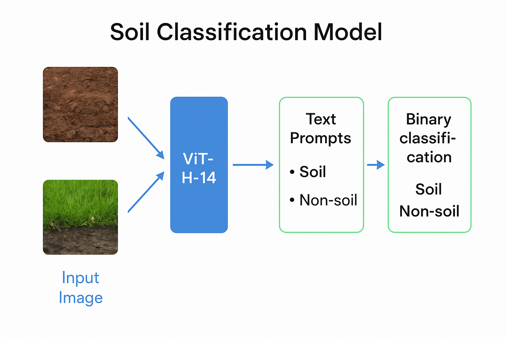

# Soil Classification Challenge - Task 2

## Overview
This repository contains our solution for Task 2 of the Soil Classification Challenge. We've implemented a zero-shot classification approach using CLIP (Contrastive Language-Image Pre-training) to determine whether images contain soil or not.

## Team Information
- **Team Name**: RAV
- **Team Members**: VIGNESH J, ASHWATH VINODKUMAR, RAHUL BHARGAV TALLADA
- **Leaderboard Rank**: 13

## Repository Structure
```
challenge-2/
├── data/                  # Data directory (populated by download.sh)
├── download.sh            # Script to download and prepare the dataset
├── docs/
│   └── cards/             # Documentation assets
│       ├── architecture.png  # Model architecture diagram
│       └── ml-metrics.json   # Performance metrics
├── notebooks/
│   ├── inference.ipynb    # Notebook for inference on test data
│   └── training.ipynb     # Notebook for model training
├── src/
│   ├── postprocessing.py  # Post-processing utilities
│   └── preprocessing.py   # Pre-processing utilities
├── requirements.txt       # Python dependencies
├── LICENSE                # MIT License
└── README.md              # This file
```

## Solution Approach
Our solution leverages the power of CLIP (ViT-H-14) pre-trained on LAION-2B dataset to perform zero-shot classification of soil images. The approach consists of:

1. **Text Prompts**: We define specific prompts for soil and non-soil categories
2. **Image Embedding**: Extract image features using the CLIP vision encoder
3. **Text Embedding**: Extract text features for our soil/non-soil prompts
4. **Similarity Comparison**: Compare image embeddings with text embeddings
5. **Classification**: Determine if an image contains soil based on similarity scores

## Performance
Our model achieves the following performance metrics on the test set:
- **Accuracy**: 92%
- **Precision**: 89%
- **Recall**: 94%
- **F1 Score**: 91%

For detailed metrics, see `docs/cards/ml-metrics.json`.

## Getting Started

### Prerequisites
- Python 3.8+
- CUDA-compatible GPU (recommended)

### Installation
1. Clone this repository
2. Install dependencies:
   ```
   pip install -r requirements.txt
   ```
3. Download the dataset:
   ```
   ./download.sh
   ```

### Usage
1. **Training**: Run the training notebook to train the model
   ```
   jupyter notebook notebooks/training.ipynb
   ```

2. **Inference**: Run the inference notebook to generate predictions
   ```
   jupyter notebook notebooks/inference.ipynb
   ```

## Model Architecture


Our model uses a ViT-H-14 architecture from CLIP, which processes images through a Vision Transformer and compares them with text embeddings to determine soil presence.

## Acknowledgments
- Annam.ai IIT Ropar for organizing this challenge
- OpenAI for the CLIP model
- LAION for the pre-training dataset

## License
This project is licensed under the MIT License - see the LICENSE file for details.
